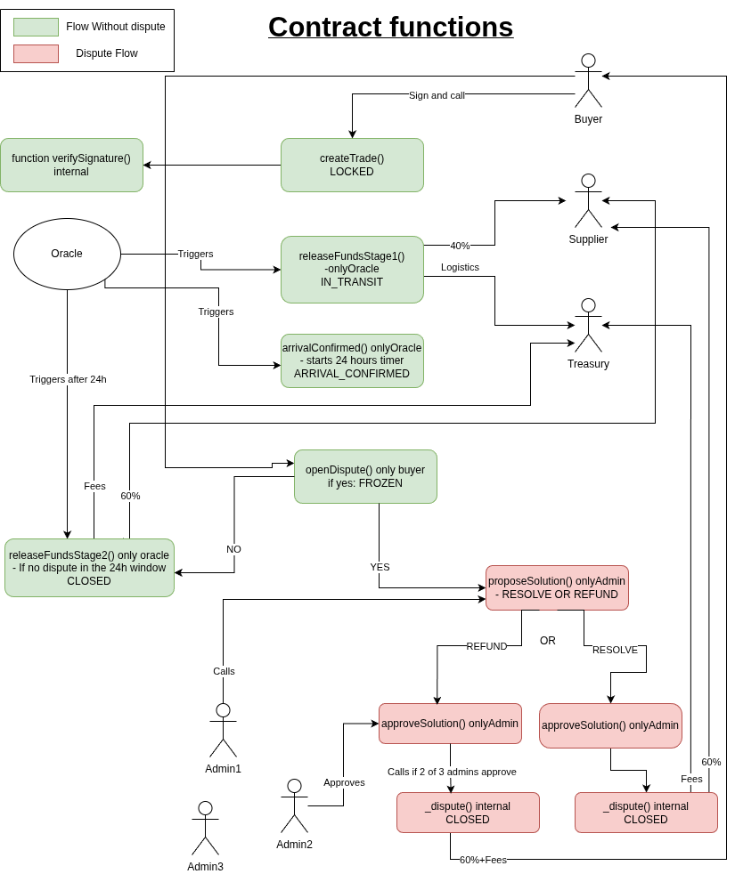

# Solidity Smart Contract (PolkaVM)

## Overview

A Solidity-based state machine deployed on PolkaVM. It handles the locking, dispute resolution, and atomic splitting of funds.

## Contract Diagram
> The diagram isn't very clean, just here to easily visualize how the contract functions work.



## Architecture
```bash
.
├── hardhat.config.ts // hardhat config file
├── package.json
├── README.md
├── src
│   ├── AgroasysEscrow.sol // Escrow smart contract
│   └── MockUSDC.sol
├── tests
│   └── AgroasysEscrow.ts // Uint tests
├── tsconfig.json
├── ignition
│   └── modules // deployment scripts
│      ├── AgroasysEscrow.ts 
│      └── MockUSDC.ts
├── foundry
│   ├── foundry.toml // fondry config file
│   ├── src
│   │   ├── AgroasysEscrow.sol
│   │   └── MockUSDC.sol // tmp contract just for testing 
│   └── test
│       ├── AgroasysEscrowFuzz.t.sol // Stateless Fuzzing test
│       └── AgroasysEscrowInvariant.t.sol // Statefull Invariant Tests
```

## Contracts structure

### Contract: `AgroasysEscrow.sol`

Escrow contract implementing secure trade execution with multi-stage fund releases and dispute resolution.


#### **Enums**
**`TradeStatus`**
- `LOCKED`: Initial deposit, funds locked in escrow
- `IN_TRANSIT`: BOL verified, stage 1 funds released (logistics + first tranche)
- `ARRIVAL_CONFIRMED`: Oracle confirms arrival, 24-hour dispute window starts
- `FROZEN`: Buyer raised dispute within 24h window, funds frozen
- `CLOSED`: Trade completed or dispute resolved

**`DisputeStatus`**
- `REFUND`: Refund buyer (second tranche + platform fees)
- `RESOLVE`: Pay supplier normally (second tranche + platform fees to treasury)


#### **Structs**
**`Trade`**
Complete trade data structure stored on-chain:
- `tradeId` (uint256): Unique identifier, auto-incremented
- `ricardianHash` (bytes32): Immutable proof of agreement (SHA-256 of legal contract)
- `status` (TradeStatus): Current trade state
- `buyerAddress` (address): Creates the trade, pays totalAmount
- `supplierAddress` (address): Receives first and second tranches
- `treasuryAddress` (address): Receives logistics + platform fees
- `totalAmountLocked` (uint256): Total amount locked by buyer
- `logisticsAmount` (uint256): Logistics fees (paid at stage 1)
- `platformFeesAmount` (uint256): Platform fees (paid at stage 2 or dispute)
- `supplierFirstTranche` (uint256): First payment to supplier (paid at stage 1, ~40%)
- `supplierSecondTranche` (uint256): Second payment to supplier (paid at stage 2, ~60%)
- `createdAt` (uint256): Trade creation timestamp
- `arrivalTimestamp` (uint256): Arrival confirmation timestamp (starts 24h window)

**`DisputeProposal`**
Multi-signature dispute proposal structure:
- `tradeId` (uint256): Trade being disputed
- `disputeStatus` (DisputeStatus): Proposed resolution method
- `approvalCount` (uint256): Number of admin approvals received
- `hasApproved` (mapping(address=>bool)): Tracks which admins approved
- `executed` (bool): Prevents double execution
- `createdAt` (uint256): Proposal creation timestamp


#### **State Variables**
**Storage Mappings:**
- `trades` (mapping(uint256 => Trade)): All trades indexed by ID
- `disputeProposals` (mapping(uint256 => DisputeProposal)): All dispute proposals
- `isAdmin` (mapping(address => bool)): Admin authorization mapping

**Counters:**
- `tradeCounter` (uint256): Auto-incrementing trade ID
- `disputeCounter` (uint256): Auto-incrementing dispute proposal ID

**Configuration:**
- `usdcToken` (IERC20): USDC token contract interface
- `oracleAddress` (address): Authorized oracle for fund releases and arrival confirmation
- `admins` (address[]): Array of admin addresses
- `requiredApprovals` (uint256): Minimum approvals required to execute dispute


#### **Functions**

**Public/External Functions:**

1. **`createTrade(supplier, treasury, totalAmount, logisticsAmount, platformFeesAmount, supplierFirstTranche, supplierSecondTranche, ricardianHash, signature)`**
   - Creates new trade with buyer signature verification
   - Locks funds in escrow (USDC transferFrom buyer)
   - Returns: `tradeId`
   - Emits: `TradeLocked`
   - Access: Anyone (msg.sender becomes buyer)
   - Requires: Valid signature, non-zero addresses, amounts matching breakdown, USDC approval

2. **`releaseFundsStage1(tradeId)`**
   - Releases first stage funds after BOL verification
   - Pays: supplier (first tranche) + treasury (logistics)
   - Changes status: LOCKED to IN_TRANSIT
   - Emits: `FundsReleasedStage1`
   - Access: `onlyOracle`

3. **`confirmArrival(tradeId)`**
   - Confirms goods arrival, starts 24-hour dispute window
   - Changes status: IN_TRANSIT to ARRIVAL_CONFIRMED
   - Sets `arrivalTimestamp` to current block timestamp
   - Emits: `ArrivalConfirmed`
   - Access: `onlyOracle`

4. **`releaseFundsStage2(tradeId)`**
   - Releases second stage funds after 24h dispute window expires
   - Pays: supplier (second tranche) + treasury (platform fees)
   - Changes status: ARRIVAL_CONFIRMED to CLOSED
   - Emits: `FundsReleasedStage2`
   - Access: `onlyOracle`
   - Requires: Called after `arrivalTimestamp + 24 hours`

5. **`openDispute(tradeId)`**
   - Buyer opens dispute within 24-hour window
   - Freezes all remaining funds in escrow
   - Changes status: ARRIVAL_CONFIRMED to FROZEN
   - Emits: `DisputeOpenedByBuyer`
   - Access: Trade buyer only
   - Requires: Called before `arrivalTimestamp + 24 hours`

6. **`proposeDisputeSolution(tradeId, disputeStatus)`**
   - Creates dispute resolution proposal
   - First admin approval automatically counted
   - Returns: `proposalId`
   - Emits: `DisputeSolution`
   - Access: `onlyAdmin`
   - Requires: Trade status must be FROZEN

7. **`approveDisputeSolution(proposalId)`**
   - Adds admin approval to dispute proposal
   - Auto-executes `_dispute()` when threshold reached
   - Emits: `DisputeApproved`, potentially `DisputeFinalized`
   - Access: `onlyAdmin`
   - Requires: Not already approved by this admin, proposal not executed

8. **`getNextTradeId()`**
   - Returns the next available trade ID
   - Returns: `tradeCounter`
   - Access: View function (anyone)

**Internal Functions:**

9. **`verifySignature(...)`**
   - Verifies buyer's signature on trade parameters
   - Returns: Recovered signer address
   - Access: Internal (called by `createTrade`)

10. **`_dispute(proposalId)`**
    - Executes approved dispute resolution
    - Distribution based on `DisputeStatus`:
      - `REFUND`: buyer receives (second tranche + platform fees)
      - `RESOLVE`: supplier receives second tranche, treasury receives platform fees
    - Changes status: FROZEN to CLOSED
    - Emits: `DisputeFinalized`
    - Access: Internal (called by `approveDisputeSolution`)


#### **Modifiers**
- `onlyOracle`: Restricts function to authorized oracle address
- `onlyAdmin`: Restricts function to approved admin addresses
- `nonReentrant`: OpenZeppelin protection against reentrancy attacks


#### **Events**
- `TradeLocked(tradeId, buyer, supplier, treasury, totalAmount, ricardianHash)`: New trade created and funds locked
- `FundsReleasedStage1(tradeId)`: Stage 1 funds released (logistics + first tranche)
- `ArrivalConfirmed(tradeId)`: Arrival confirmed, 24h dispute window started
- `FundsReleasedStage2(tradeId)`: Stage 2 funds released (platform fees + second tranche)
- `DisputeOpenedByBuyer(tradeId)`: Buyer opened dispute, trade frozen
- `DisputeSolution(proposalId, tradeId, disputeStatus, proposer)`: Admin proposed dispute solution
- `DisputeApproved(proposalId, approver, approvalCount, requiredApprovals)`: Admin approved dispute proposal
- `DisputeFinalized(proposalId)`: Dispute executed, funds distributed


### Contract: `MockUSDC.sol`

ERC20 test token for local development and testing.


## Tests:

### Test Coverage Summary
| Framework | Type | Files | Tests |
|-----------|------|-------|-------|
| Hardhat | Unit Tests | `tests/AgroasysEscrow.ts` | 41 tests |
| Foundry | Stateless Fuzz | `foundry/test/AgroasysEscrowFuzz.t.sol` | 7 tests |
| Foundry | Stateful Invariants | `foundry/test/AgroasysEscrowInvariant.t.sol` | 7 invariants |

---

### Unit Tests `AgroasysEscrow.ts`
```
  AgroasysEscrow: createTrade
    Success:
      ✔ Should create a trade successfully with valid signature (44ms)
      ✔ Should create multiple trades (59ms)
    Failure:
      ✔ Should reject invalid signature
      ✔ Should reject invalid ricardian hash (bytes32(0))
      ✔ Should reject invalid supplier address (address(0))
      ✔ Should reject invalid treasury address (address(0))
      ✔ Should reject mismatched amounts (sum != total)
      ✔ Should reject without USDC approval
      ✔ Should reject with insufficient USDC balance

  AgroasysEscrow: releaseFundsStage1
    Success:
      ✔ Should release stage 1 funds
    Failure:
      ✔ Should reject if caller is not oracle
      ✔ Should reject if trade doesn't exist
      ✔ Should reject if status is IN_TRANSIT
      ✔ Should reject if status is ARRIVAL_CONFIRMED
      ✔ Should reject if status is CLOSED (47ms)
      ✔ Should reject if status is FROZEN

  AgroasysEscrow: confirmArrival
    Success:
      ✔ Should confirm arrival and start 24h dispute window
    Failure:
      ✔ Should reject if caller is not oracle
      ✔ Should reject if trade doesn't exist
      ✔ Should reject if already called

  AgroasysEscrow: releaseFundsStage2
    Success:
      ✔ Should release stage 2 funds after 24h window
      ✔ Should complete full user flow (without dispute)
    Failure:
      ✔ Should reject if caller is not oracle
      ✔ Should reject if trade doesn't exist
      ✔ Should reject if called before 24h window expires
      ✔ Should reject if already called (status is CLOSED)

  AgroasysEscrow: Dispute Flow
    openDispute
      Success:
        ✔ Should allow buyer to open dispute within 24h window
        ✔ Should work just before 24h window expires
      Failure:
        ✔ Should reject if caller is not buyer
        ✔ Should reject after 24h window expires
        ✔ Should reject if already disputed
    Success: Complete Dispute Flow: REFUND
      ✔ Should refund buyer completely (tranche2 + platform fees) (46ms)
    Success: Complete Dispute Flow: RESOLVE
      ✔ Should pay supplier tranche2 + treasury platform fees (51ms)
    Failure: proposeDisputeSolution
      ✔ Should reject if caller is not admin
      ✔ Should reject if trade doesn't exist
      ✔ Should reject if trade is not FROZEN
    Failure: approveDisputeSolution
      ✔ Should reject if caller is not admin
      ✔ Should reject if proposal doesn't exist
      ✔ Should reject double approval from same admin
      ✔ Should reject if proposal already executed
      ✔ Should reject if trade is not FROZEN anymore


  41 passing (4s)

---------------------|----------|----------|----------|----------|----------------|
File                 |  % Stmts | % Branch |  % Funcs |  % Lines |Uncovered Lines |
---------------------|----------|----------|----------|----------|----------------|
 src/                |    97.62 |    78.57 |    93.75 |    98.11 |                |
  AgroasysEscrow.sol |    98.78 |    78.57 |      100 |    99.04 |            282 |
  MockUSDC.sol       |       50 |      100 |    66.67 |       50 |             10 |
---------------------|----------|----------|----------|----------|----------------|
All files            |    97.62 |    78.57 |    93.75 |    98.11 |                |
---------------------|----------|----------|----------|----------|----------------|

```

### Stateless Fuzzing tests `AgroasysEscrowFuzz.t.sol`

```
Ran 7 tests for test/AgroasysEscrowFuzz.t.sol:FuzzTest
[PASS] testFuzz_CannotOpenDisputeAfter24Hours(uint96,uint96,uint96,uint96,bytes32) (runs: 10001, μ: 480083, ~: 480494)
[PASS] testFuzz_CannotOpenDisputeBeforeArrival(uint96,uint96,uint96,uint96,bytes32) (runs: 10000, μ: 450936, ~: 451361)
[PASS] testFuzz_CannotReleaseStage2Before24Hours(uint96,uint96,uint96,uint96,bytes32) (runs: 10000, μ: 484306, ~: 484716)
[PASS] testFuzz_completeUserFlowWithDisputeRefund(uint96,uint96,uint96,uint96,bytes32) (runs: 10000, μ: 837186, ~: 837599)
[PASS] testFuzz_completeUserFlowWithDisputeResolve(uint96,uint96,uint96,uint96,bytes32) (runs: 10000, μ: 866426, ~: 866839)
[PASS] testFuzz_completeUserFlowWithoutDispute(uint96,uint96,uint96,uint96,bytes32) (runs: 10001, μ: 626095, ~: 626510)
[PASS] test_Setup() (gas: 31960)
Suite result: ok. 7 passed; 0 failed; 0 skipped; finished in 10.62s (40.84s CPU time)

Ran 1 test suite in 10.62s (10.62s CPU time): 7 tests passed, 0 failed, 0 skipped (7 total tests)
```

### Statefull Fuzzing Invariant tests `AgroasysEscrowInvariant.t.sol`

**Handler:**
The handler functions call the contract using valid values derived from fuzzing tests inputs.

Example: If the fuzzing input looks like `tradeId = 999999`, the Handler converts it to a valid ID using `tradeId % tradeCounter` before calling the escrow contract.


**Invariants Tested:**

1. **`invariant_EscrowBalanceMatchesLockedFunds`**
   - Escrow USDC balance = sum of all locked funds

2. **`invariant_EscrowFundsConservation`**
   - Escrow balance = total deposited - total withdrawn

3. **`invariant_TotalWithdrawnNeverExceedsDeposited`**
   - Total withdrawn ≤ total deposited

4. **`invariant_TradeCreationNumber`**
   - Handler trade counter = contract trade counter

5. **`invariant_DisputesSolvedMatches`**
   - Number of DISPUTED trades = dispute execution count

6. **`invariant_TriggerStage1GreaterThanTriggerStage2`**
   - Stage 1 releases ≥ Stage 2 releases

7. **`invariant_DisputeRaisedGreaterThanDisputeSolved`**
   - Dispute proposals ≥ disputes executed


## Scripts: 
Deployement Scripts for the 2 contracts in:
```
ignition
└── modules
    ├── AgroasysEscrow.ts
    └── MockUSDC.ts
```

## Set Up project

### Hardhat Config
```bash
cd contracts
yarn install
```

### Fondry Config
```bash
cd foundry
forge install --no-git foundry-rs/forge-std
forge install --no-git OpenZeppelin/openzeppelin-contracts
forge build
```


## Running Tests

### Hardhat Unit Tests
```bash
yarn compile
yarn test
yarn coverage
```

### Fondry Fuzzing Tests
```bash
cd foundry
forge build
forge test --match-contract FuzzTest -vvv
forge test --match-contract InvariantTest -vvv
```

## Deploy Contracts
```bash
npx hardhat ignition deploy ignition/modules/MockUSDC.ts --network polkadotTestnet
npx hardhat ignition deploy ignition/modules/AgroasysEscrow.ts --network polkadotTestnet
```

## Addresses

- mock-usdc: 0xEea5766E43D0c7032463134Afc121e63C9f9C260
- escrow: 0x8E1F0924a5aA0D22fB71e5f34f25111FF487379a

## Script
```bash
npx hardhat run scripts/trade/createTrade.ts --network polkadotTestnet
npx hardhat run scripts/trade/releaseStage1.ts --network polkadotTestnet
npx hardhat run scripts/trade/confirmArrival.ts --network polkadotTestnet
npx hardhat run scripts/trade/releaseFinalTranche.ts --network polkadotTestnet
npx hardhat run scripts/trade/openDisputeByBuyer.ts --network polkadotTestnet
```

```bash
```

```bash
```

```bash
```

## Next Steps
- Gas optimization
- Add NatSpec comments