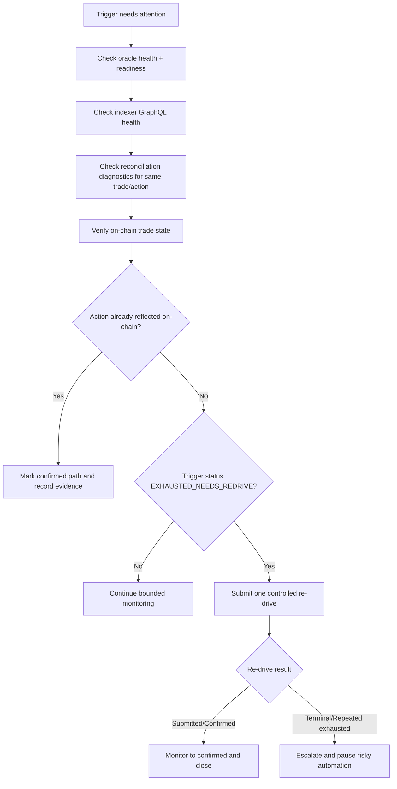

# Oracle Re-drive Runbook

## Purpose
Handle `EXHAUSTED_NEEDS_REDRIVE` oracle triggers with explicit ownership, bounded retries, and on-chain verification safeguards.

## Ownership And Intervention Rules
- `Operator`:
  - Runs health/diagnostic checks.
  - Collects incident evidence (`tradeId`, `actionKey`, `requestId`, `txHash`).
  - Performs one controlled manual re-drive only after checklist completion.
- `On-call Engineer`:
  - Decides `retry now` vs `continue monitoring` vs `pause automation`.
  - Validates reconciliation/indexer consistency before additional retries.
- `Service Owner`:
  - Owns rollback/hotfix decision when repeated exhaustion or correctness risk is present.

Manual intervention is allowed only when a trigger reached `EXHAUSTED_NEEDS_REDRIVE` (or a hard-timeout path moved it there). For `SUBMITTED` triggers below hard timeout, continue monitoring unless an on-call engineer declares escalation.

## Runtime Retry Ceilings And Stop Conditions
- Trigger execution retries:
  - Controlled by `RETRY_ATTEMPTS` (default `3`, allowed range `0..10`).
  - Backoff uses exponential delay from `RETRY_DELAY` (default `1000ms`) with jitter, capped at `30000ms`.
- Confirmation polling:
  - Poll interval: `10s`.
  - Soft timeout warning: `5m`.
  - On-chain fallback checks begin at `20m`, rate-limited per `tradeId` to once every `5m`.
  - Hard timeout: `30m` then status becomes `EXHAUSTED_NEEDS_REDRIVE`.

Stop and escalate immediately when any of the following happens:
- `TERMINAL_FAILURE` status (non-retryable business/contract error).
- Re-drive attempt returns repeated `EXHAUSTED_NEEDS_REDRIVE` for the same `actionKey`.
- Conflicting truth sources (indexer/reconciliation/on-chain disagreement that cannot be resolved in one pass).
- Any signal of duplicate action risk for one `actionKey`.

## Preconditions
- Oracle service is running and reachable.
- Trigger status targeted for re-drive is `EXHAUSTED_NEEDS_REDRIVE`.
- RPC and indexer endpoints are reachable and on the same chain dataset.

## Decision Flow


## Commands
Service health:

```bash
curl -fsS http://127.0.0.1:3001/api/oracle/health
curl -fsS http://127.0.0.1:3001/api/oracle/ready
```

Operational diagnostics (profile as appropriate):

```bash
scripts/docker-services.sh health staging-e2e-real
scripts/docker-services.sh logs staging-e2e-real oracle
scripts/docker-services.sh logs staging-e2e-real reconciliation
scripts/docker-services.sh logs staging-e2e-real indexer-graphql
```

Example re-drive request:

```bash
curl -X POST http://127.0.0.1:3001/api/oracle/redrive \
  -H 'Content-Type: application/json' \
  -H "x-api-key: ${ORACLE_API_KEY}" \
  -H "x-hmac-signature: <signature>" \
  -d '{"tradeId":"123","triggerType":"RELEASE_STAGE_1","requestId":"manual-redrive-001"}'
```

## Expected Results
- Idempotency is preserved by `actionKey`/`idempotencyKey`.
- If action was already executed on-chain: trigger is marked confirmed without duplicate execution.
- If still pending: one new re-drive attempt is created and processed under bounded retry policy.

## Evidence To Collect For Incidents
- Service health and readiness output.
- Oracle/reconciliation/indexer logs around affected `tradeId`.
- Trigger record status history with `attempt_count`, `last_error`, and timestamps.
- Transaction hashes and on-chain state evidence used for decisioning.

## Escalation Matrix
- `SEV-1` (page immediately, response target: `<= 15 min`):
  - Duplicate release risk, conflicting confirmation outcomes, or widespread terminal failures.
- `SEV-2` (response target: `<= 30 min`):
  - Repeated exhausted retries on multiple trades with no duplication risk yet.
- `SEV-3` (response target: `<= 2 hours`):
  - Isolated redrive failures with clear operator recovery path.

When escalating, include: `tradeId`, `actionKey`, `requestId`, `txHash`, current status, retry count, and last 15 minutes of logs from oracle/reconciliation/indexer.

## Rollback / Backout
1. Pause manual re-drive operations.
2. Run `docs/incidents/first-15-minutes-checklist.md`.
3. Capture evidence bundle and notify on-call/service owner.
4. Restore previous known-good oracle deployment/config if regression is suspected.

## Cross-Links
- Incident checklist: `docs/incidents/first-15-minutes-checklist.md`
- Staging gate runbook: `docs/runbooks/staging-e2e-real-release-gate.md`
- Staging gate diagnostics (non-real profile): `docs/runbooks/staging-e2e-release-gate.md`
- Hybrid lifecycle walkthrough: `docs/runbooks/hybrid-split-walkthrough.md`